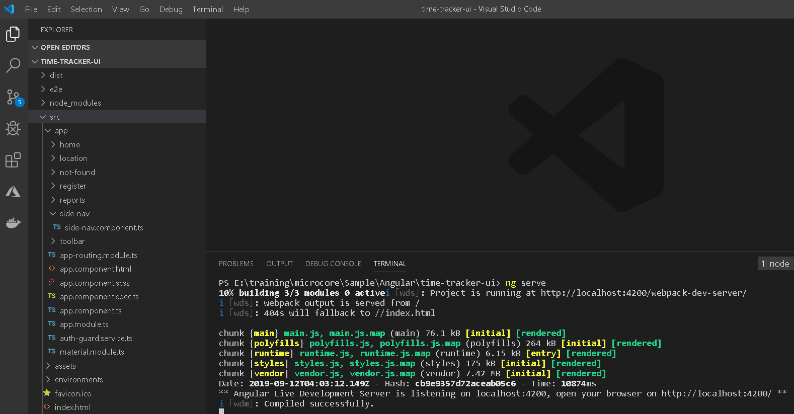
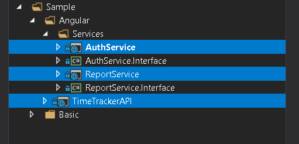
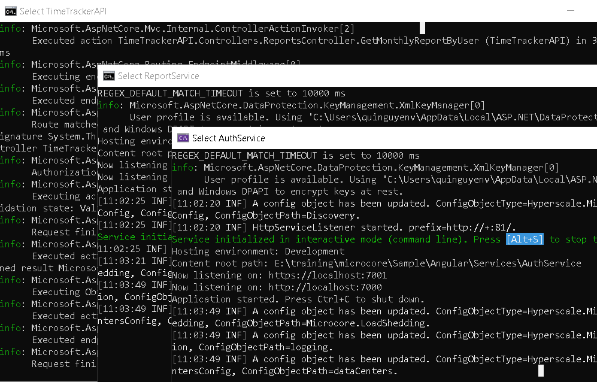
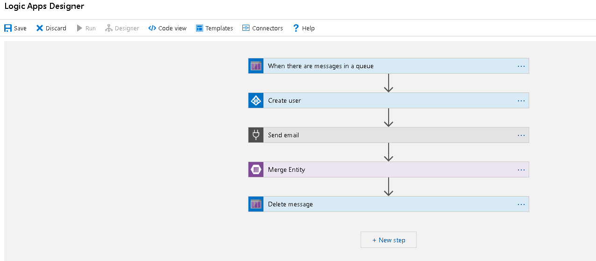
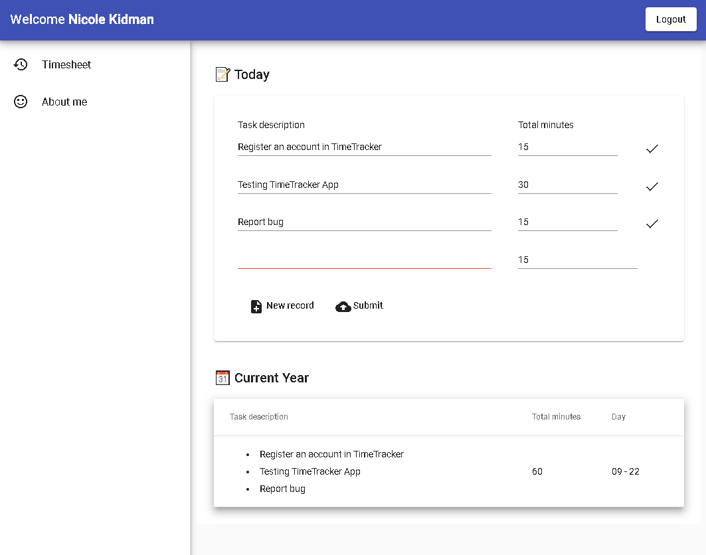
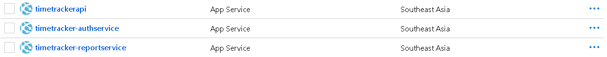

# Introduction

This is demonstration of basic example of single page Angular application and microservice architecture. The Angular application uses adal-angular4 to authenticate against Azure Active Directory users. 
The backend side, we use simple API Gateway which is implemented by ASP.Net Core 2.2 Web API and there are two small microservices, ReportService and AuthService. 

The communication between microservices is asynchronous HTTP and is handled by https://github.com/quinvit/microcore library. The library covers network call, serialization/deserialization, service proxying and contract mapping. We only use remote service by using DI to inject service interface to constructor as normal in-process service injection.


# Contents

1. time-tracker-ui folder contains sample code of Angular application.
2. TimeTrackerAPI folder contains sample code of API Gateway
3. Services folder contains sample code of two simple microservices.

In angular frontend, we simply use adal-angular4 library to authenticate against Azure Active Directory users and auto-attach jwt bearer token when we call any API using HttpClient.
```
@Component({
    selector: 'app-reports',
    templateUrl: './reports.component.html',
    styleUrls: ['./reports.component.css']
})
export class ReportsComponent implements OnInit {

    displayedColumns: string[] = ['tasks', 'totalMinutes', 'day'];
    dataSource = ELEMENT_DATA;

    constructor(private http: HttpClient) { }

    ngOnInit() {
        this.http.get<DailyTimeSheetByUser[]>(`${environment.config.apiGateway}/api/Reports/MonthlyReportByUser`)
        .subscribe(x => {
            this.dataSource = x;
        });
    }
}
```
For more detail about this library, please take a look at this article https://adrianszen.com/2019/02/19/angular-with-azure-active-directory-authentication-adal-angular4/.

To start angular application, type ***ng serve*** in terminal.



Register micro-services in Discovery.config:
```
<?xml version="1.0" encoding="utf-8" ?>
<configuration>
  <Discovery>
    <Services>
      <ReportService Source="Config" Hosts="localhost:80" />
      <AuthService Source="Config" Hosts="localhost:81" />
      
      <!--<ReportService Source="Config" Hosts="timetracker-reportservice.azurewebsites.net:80" />
      <AuthService Source="Config" Hosts="timetracker-authservice.azurewebsites.net:80" />-->
    </Services>
  </Discovery>
</configuration>
```

This is how micro-services are integrated to ASP.NET Core (Startup.cs):
```
public Startup(IConfiguration configuration)
{
    ...
    StandardKernel = new StandardKernel();
    StandardKernel.Load<MicrocoreModule>();
    StandardKernel.Load<SerilogModule>();
}
```
```
public void ConfigureServices(IServiceCollection services)
{
    ...
    services.AddTransient((o) => StandardKernel.Get<IReportService>());
    services.AddTransient((o) => StandardKernel.Get<IAuthService>());
}
```

Inject remote service to the backend API code in API Gateway:
```
[Authorize]
[Route("api/[controller]")]
[ApiController]
public class ReportsController : ControllerBase
{
    private IReportService _reportService;

    public ReportsController(IReportService reportService)
    {
        _reportService = reportService;
    }

    // GET: api/Reports
    [HttpGet]
    [Route("MonthlyReportByUser")]
    public async Task<DailyTimeByUser[]> GetMonthlyReportByUser()
    {
        var token = await this.HttpContext.GetTokenAsync("access_token");
        return await _reportService.GetMonthlyReportByUserAsync(token);
    }
}
```

To start backend API Gateway and micro-services at local, just run these projects in Visual Studio 2019:



Here is how it works:



You can use sample users 
- dev0001@quioutlookcom.onmicrosoft.com/HVN@Welc0meHVN@Welc0me
- dev0002@quioutlookcom.onmicrosoft.com/HVN@Welc0meHVN@Welc0me

After login, click on Timesheet menu to retrieve data from server. Here is the data flow:


- -> Angular application

    - -> API Gateway

        - -> ReportService (retrieve report data in azure table)

            - -> AuthService (retrieve logged-in user information in azure storage)

        - -> AuthService (add registration information to azure table)

            - -> Push a message to azure queue to trigger azure login app to create AD user and send email with initial password

The user registration information is pushed to azure storage queue and there is an azure logic app will handle user creation and send email with initial password.



To run and store data locally, we need to run Azure Storage Emulator. Finally, after login with demo user, this is how the application looks like:



The API Gateway and microservices are deployed to Azure Web App (Linux docker container mode) in order we can easily scale up or scale out any service. On the other hand, hosting microservice in Azure Web App is much cheaper than on VM or AKS. The secure our microservices that are hosted under azure web app, we need to use a Virtual Network with enabled Service Endpoint, join our azure web app to that Virtual Network and then restrict all external access to the web app, except the requests that come from our Virtual Network.

For the angular dist, we simply put all output files of ***ng build --prod*** result to an Azure Storage with enabled Static Website feature.

# Deploy to Azure



Try final result [here](https://quinvit.z23.web.core.windows.net)
